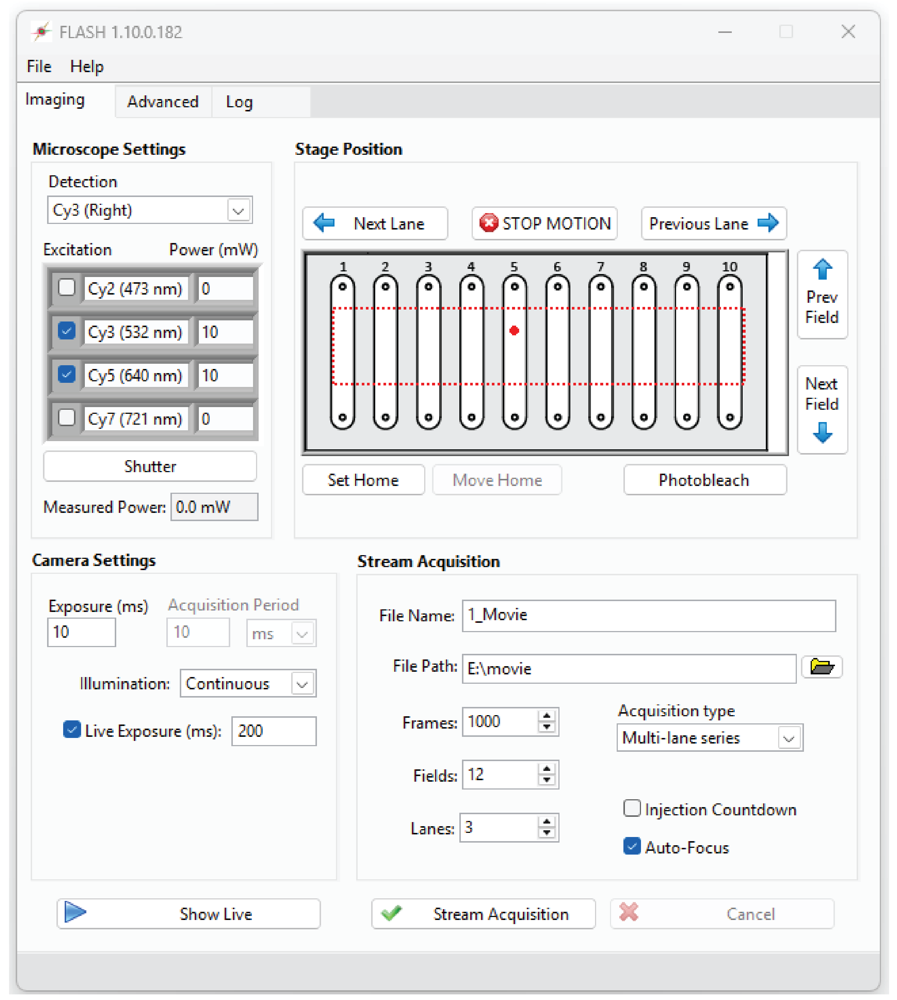

.. _flash_documentation-using_flash:

Using FLASH
===========

Main Window
-----------

Turn on all devices, wait for them to finish their startup routine, and launch FlashGordon.exe (or
FLASH.vi for source code version). Select the appropriate configuration (see above) and click “Ok”.
After starting, the Main Window will open. The Main Window is used for controlling all devices and
collecting data:

**Microscope Settings**

- **Detection**: specifies the microscope light path, including the filter set and imaging port.

- **Excitation:** the check boxes specify which laser line is active (will open in Stream Acquisition and Show Live modes, or when manually clicking the “Shutter” button).

- **Power (mW):** change this value and hit Enter to adjust the laser power for this line (if configured). If the power on the device is independently adjusted, the Main Window will not be automatically updated.

- **Shutter:** pressing this button will open/close the currently active shutter(s).

- **Measured Power:** if a power meter is connected and configured, this will show the current laser power (measured power times attenuation factor).

**Camera Settings**

- **Exposure (ms):** time that the camera is exposing and the laser shutters are open within each frame interval. In continuous illumination, this is the same as frame interval.

- **Acquisition Period**: time period between the start of each frame.

- **Illumination**: select the imaging mode (Continuous, ALEX, or Stroboscopic). See the section below for a more complete description of these options.

- **Live Exposure (ms):** if checked, “Show Live” will use this exposure time instead – the “Exposure (ms)” field is always used for “Stream Acquisition”. This can be useful for manually focusing at low before taking each new movie.

- **Show Live**: opens the Live Viewer and opens any active shutter(s). Click again to close the viewer.

**Stage Position:**

The image in the center of this pane is a diagram of the slide. This image can be changed by
replacing the file “slide diagram.png” in the FLASH root folder. The red dotted lines show the
software stage limits. The large red circle shows the current stage position.

- **Next/Prev. Field**: moves the stage in the X direction (in line with fluidics ports) by the interval specified in the configuration file. This interval is also used clicking the “Stream Acquisition” button with “Auto-advance” checked.

- **Next/Prev. Lane**: moves the stage in the Y direction (towards another channel) by the interval specified in the configuration file.

- **Photobleach**: move the stage in the X direction in small increments for the full distance specified in the configuration file. The purpose of this mode is for the user to photobleach any unwanted molecules on the surface in the current lane. If configured, laser power will automatically be increased before motion starts.

- **Set (home)**: use the current stage position as “home”. With the ESP301, this sets the zero position on the stage controller itself. With Ti2, this only sets a software zero position since the Ti2 does not have a configurable “home” position. Zeroing the position on the Ti2 control pad has no effect on this setting.

- **Return to home**: move stage to the zero position (if set). Use care when setting the zero position to avoid damage to the stage and objective.

- **STOP**** MOTION**: abort any current stage motion (such as photobleaching command).

**Stream Acquisition:**

- **File Name** and Path**: any file extension is ignored (.tif will be appended to the name regardless). Any folders must first be created by the user.

- **Frames:** number of frames to acquire in a stream acquisition (not including skipped frames specified in the Advanced tab).

- **Acquisition Type:**

- **Single movie:** acquire one movie in current field of view.

- **Movie series:** acquire several movies, moving to a new field after each, with files numbered like this: “…_001.tif”, etc. All movies are within one lane.

- **Multi-lane series:** acquire several movies, moving first across fields (Y direction) and then across lanes (X direction), with files numbered like this: “…_A01.tif”. Letters represent fields (X) and numbers are lanes (Y).

- **Sweep Parameter**: acquires several movies varying the selected parameter(s), such as laser power, through a specified series of values. Files are numbered according to the selected parameter(s), e.g., “…_100mW_000.tif”.

- **Injection Countdown**: at the start of each stream acquisition, a timer appears that counts down to zero to mark the moment shutters open and the first frame is exposing. This mode is useful for timing manual injections with the start of acquisition.

- **Auto focus**: enables image-based autofocus. At the start of each movie, the laser power is reduced to minimum (if configured), a Z stack is acquired to determine the optimal Z position, and the laser power is returned to the previous value before starting the acquisition. This can add a significant delay, please be patient.

- **Stream Acquisition**: start acquiring movie(s).

- **Cancel**: stops the acquisition early. You will be prompted to save the truncated movie if desired.

Advanced Tab
------------

Settings and commands that are less commonly used, a few of which are described below:

.. figure:: ../_static/flash_documentation/img_flash_documentation_0001.png
   :name: fig-flash_documentation-1
   :alt: img_flash_documentation_0001.png

- **Binning:** on-camera pixel binning. Default is 2x2.

- **Readout Mode:** if ‘auto’ is elected (default), automatically selects the readout mode that gives the maximum field of view size and lowest noise levels for the parameters selected by the user. This value should be changed in some scenarios, such as when one readout mode has other desirable properties like a larger full-well depth or when the user wants to maintain consistency in camera settings between recordings with different exposure times.

- **Active Cameras:** select a subset of connected cameras to be used in Live and Stream Acquisition modes.

- **Fluidics trigger:** at this frame number, a one-frame TTL pulse will be sent to trigger an external device. Set to zero to disable.

- **Calibrate Polarizer:** initiates a series of polarizer motor movements and power meter measurements to determine the calibration parameters to translate power settings to polarizer angles. These values must be manually entered into the configuration file; it is not automatically updated.

- **Forward step/lane separation**: manually adjust the stage movement distances. These values are only kept during the current session. You must edit the configuration file to make any changes permanent.

- **Enforce software stage limits:** if unchecked the stage limits in the configuration file (red dotted line in the main tab) are ignored.

- **Autofocus:** manually start the autofocus routine in current field of view, without changing laser power.

Autosampler Tab
---------------

.. figure:: ../_static/flash_documentation/img_flash_documentation_0002.png
   :name: fig-flash_documentation-2
   :alt: img_flash_documentation_0002.png

This tab will be visible only if an autosampler is configured and connected.

- **Manual control:** buttons directly execute basic movements on the device. The parameter fields are not updated as the device moves.

- **Autosampler Status:** displays the current positions of the various components of the device, including valve positions and needle arm position.

Show Live
---------

To see acquired images from the cameras without saving any data, click the “Show Live” button in the
main window. A new window will appear showing the frame data from all active cameras. The Live
Viewer window includes several controls at the top. These settings only affect the display of the
pixel data and have no effect on the acquired movies.

.. figure:: ../_static/flash_documentation/img_flash_documentation_0003.png
   :name: fig-flash_documentation-3
   :alt: Color Map: changes the mapping of monochrome pixel intensity values to colors.

   Color Map: changes the mapping of monochrome pixel intensity values to colors.

- **Range (bits)**: specifies the maximum pixel value of the histogram.

- **Auto Scale:** if checked, the histogram scale bar will be automatically adjusted to be in an optimal range. Uncheck to manually set the position of the scale bar.

- **Subtract Baseline:** subtract the bias level from each camera in order to ensure all cameras have the same baseline.

- **Histogram:** gray bar chart shows the pixel intensities of the acquired images from all cameras. The colorful plot shows how these values are translated to colors in the viewer. The ends of this plot can be moved to adjust the minimum and maximum values the mapping of pixel values onto the color scale (if “Auto Scale” is not selected). Typically the lower end is set on the large peak corresponding to background pixels, while the upper end is set so that the molecule pixel intensities are clearly visible but not oversaturated, especially when adjusting the focus.

- **Alignment**: if checked, the Live Viewer will display the image of one camera subtracted from another to adjust their relative alignment. The scaling parameter is useful when two spectral bands have very different intensities and is most often used with the far-red (Cy7) channel.

- **Status Bar:** displays the number of frames recorded, a progress bar for the recording, and an estimated number of detected particles in the first channel (using an algorithm similar to the one used in SPARTAN).

.. figure:: ../_static/flash_documentation/img_flash_documentation_0004.png
   :name: fig-flash_documentation-4
   :alt: NOTE: the Live Viewer executes in a separate thread that only updates every ~100 ms. Images may update slowly or cameras may appear out of sync. This is all normal. To verify that devices are properly synchronized, use an oscilloscope connected to the outport ports of the cameras and other devices.

   NOTE: the Live Viewer executes in a separate thread that only updates every ~100 ms. Images may update slowly or cameras may appear out of sync. This is all normal. To verify that devices are properly synchronized, use an oscilloscope connected to the outport ports of the cameras and other devices.

Stream Acquisition
------------------

To acquire a movie, click the “Stream Acquisition” button. The Live Viewer window will appear and
the cameras will stream raw data to disk. A progress bar will appear in the bottom of the viewer
window. When the acquisition is complete, the live viewer will close. The raw data is converted into
a .tif file in the background, with the progress displayed at the bottom of the main window next to
“Saving Movie”. There is no problem with starting an acquisition while the previous movie is still
saving. If you click “Cancel” or close the live viewer window, you will be prompted on whether to
save the already-acquired frames.

.. figure:: ../_static/flash_documentation/img_flash_documentation_0005.png
   :name: fig-flash_documentation-5
   :alt: img_flash_documentation_0005.png
